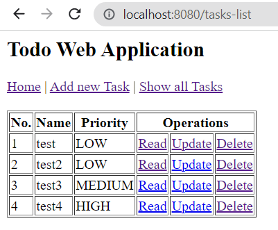

# Todo
My First JSP Servlets Project. It's a traditional Todo app with task management features.

## Main functionality:
- Create tasks
- Read tasks
- Update tasks
- Delete tasks

## Get Started:
- Run Tomcat Server

## Images

